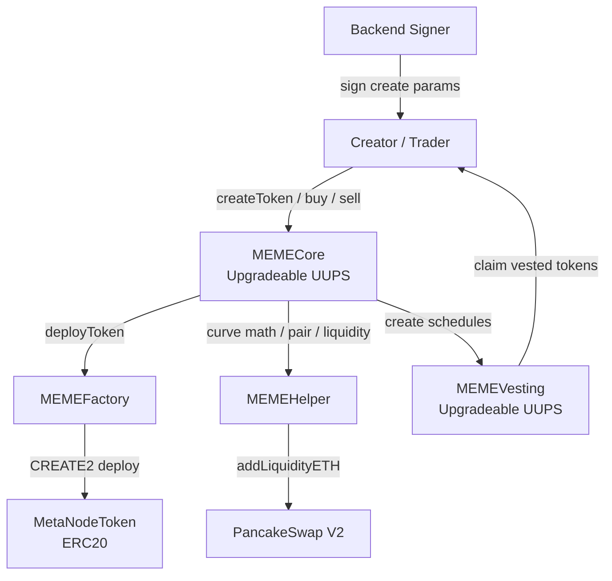
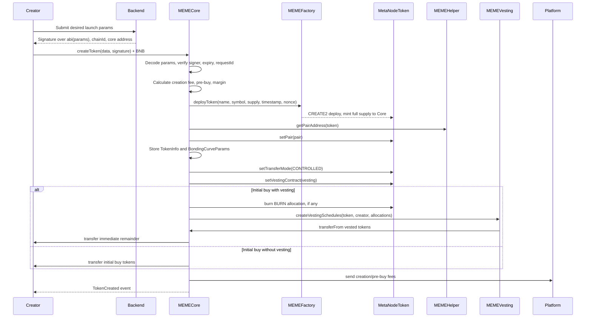
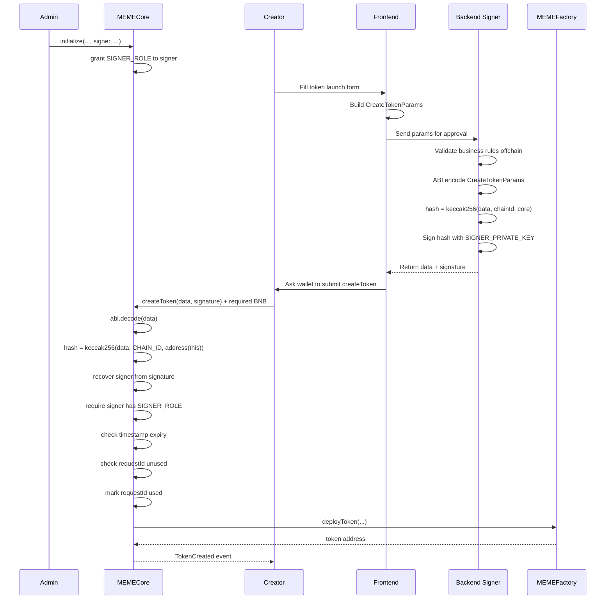
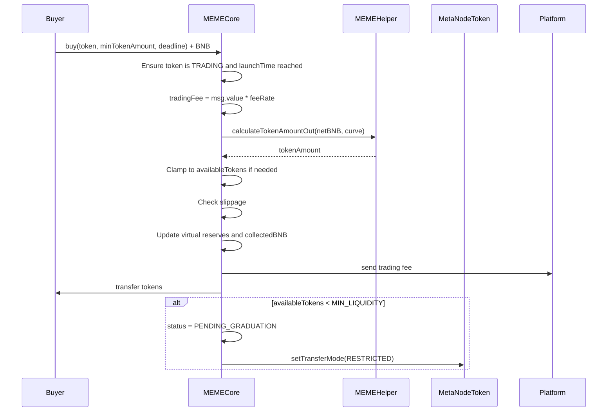
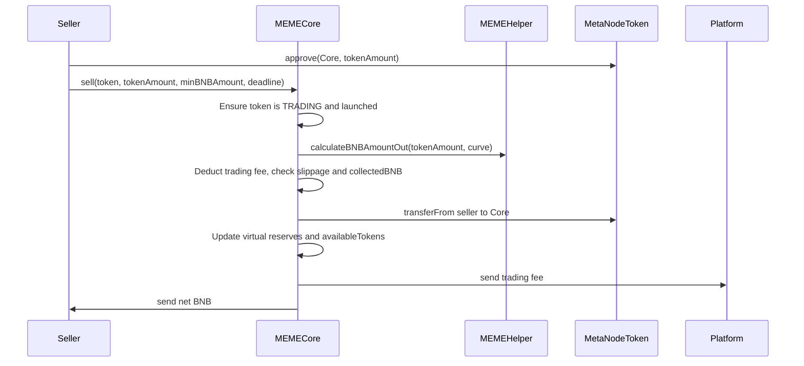
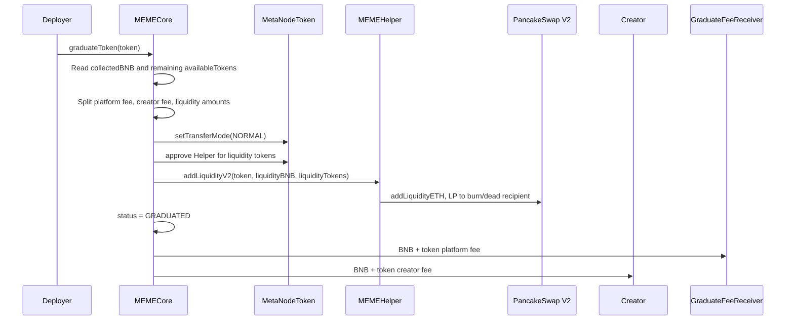
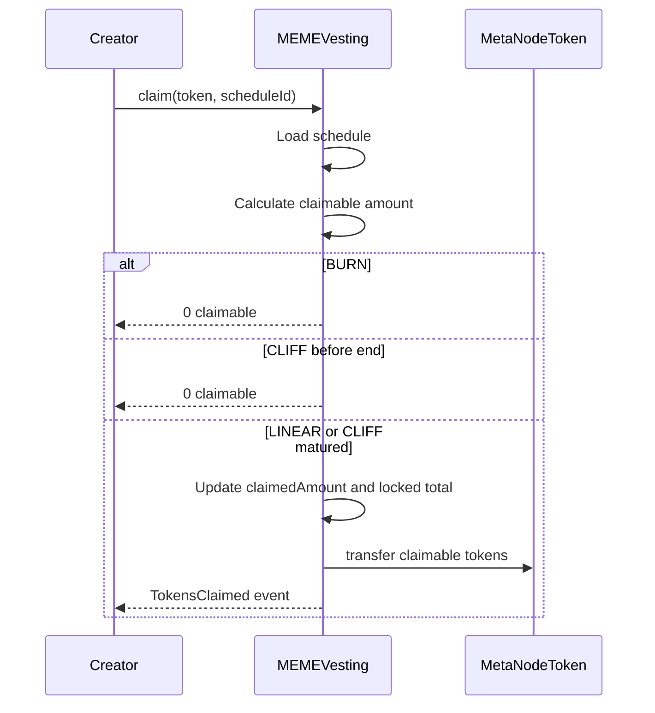

# MEME Launchpad
## Overview
It is a Foundry-based MEME token launchpad where MEMECore manages token creation, bonding-curve trading, vesting, and graduation into PancakeSwap-style liquidity.
Core files:
- MEMECore.sol: the launchpad ledger and rule engine, main lifecycle contract.
- MEMEFactory.sol: deploys new ERC20 tokens with `CREATE2`.
- MEMEToken.sol: launched ERC20 token with transfer restrictions until graduation.
- MEMEHelper.sol: bonding curve math and PancakeSwap v2 liquidity helper.
- MEMEVesting.sol: holds locked creator allocations.

## Architecture

- `MEMECore` is the brain. It stores token state, validates backend signatures, charges fees, initializes bonding curves, handles buys/sells, manages graduation, and controls pause/blacklist states.
- `MEMEFactory` is deliberately small. Only addresses with `DEPLOYER_ROLE`, normally `MEMECore`, can call `deployToken`. It uses `CREATE2`, so token addresses can be predicted before deployment.
- `MetaNodeToken` is the ERC20 that gets deployed per launch. It starts in restricted mode, then controlled mode during bonding-curve trading, then normal mode after graduation. The key transfer modes are defined in `MEMEToken.sol` (line 44).
- `MEMEHelper` contains the constant-product math: k = virtualBNBReserve * virtualTokenReserve. Buying increases virtual BNB reserve and decreases virtual token reserve; selling does the reverse.
- `MEMEVesting` stores schedules by `token -> beneficiary -> scheduleId`. It supports `BURN`, `CLIFF`, and `LINEAR` modes from `IVestingParams.sol` (line 25).
## Bonding Curve
The bonding curve here is a temporary AMM before the token "graduates" to PancakeSwap.

                    Bonding Curve: x * y = k

      Token reserve y
      ^
      |
      |     Start
      |      *
      |       \
      |        \
      |         \
      |          \
      |           \
      |            *  After creator initial buy
      |             \
      |              \
      |               \
      |                *  After public buys
      |
      +------------------------------------------------> BNB reserve x


      x = virtualBNBReserve
      y = virtualTokenReserve
      k = x * y
      price = x / y

      As x increases, y decreases.
      As users buy, price goes up.

- For a buy

Before buy:
```
    x0 = virtualBNBReserve
    y0 = virtualTokenReserve
    k  = x0 * y0
```
User pays BNB: `bnbIn = amount paid into curve`

After buy:
```
    x1 = x0 + bnbIn
    y1 = k / x1 (y1 < y0)
```
Tokens received: `tokensOut = y0 - y1`

- So as users buy more:
```
virtualBNBReserve (x) goes up
virtualTokenReserve (y) goes down
price (x / y) goes up
availableTokens goes down
collectedBNB goes up
```

## Timeline flows
### Token Creation Sequence

The main entry point is `MEMECore.createToken (line 385)`. Important checks happen there: signature validity, one-time requestId, sale amount validity, max initial buy 9990 basis points, and payment sufficiency.
One subtle but important design choice: the created token mints the entire supply to `MEMECore`, not the creator. The core contract then releases tokens according to launch rules.

### Offchain Approval for Token Creation
The backend signer is offchain approval authority for `MEMECore.createToken`. Creator's wallet submits the signed payload to `MEMECore`. The contract verifies the request payload was signed by an address that has `SIGNER_ROLE` in `MEMECore`.

So the flow is:
1. `Deploy` script initializes `MEMECore` with tokenomics params and roles (including signer for `MEMECore.createToken`) 
2. `Backend` Signs message using private key.
3. `MEMECore`
    - Recovers signer address.
    - Checks if recovered address have `SIGNER_ROLE`, If yes: request approved; otherwise: revert

This pattern is powerful because the backend can dynamically approve launches by signing **without** storing everything onchain:
```solidity
mapping(address => bool) approved;
```


### Vesting
Real token launches often want mixed rules, for example:
```
Initial buy = 10% of total supply

2% burn forever
3% cliff unlock after 30 days
3% linear unlock over 90 days
2% sent immediately
```
That needs multiple allocations:
```solidity
[
    { amount: 200, mode: BURN,   duration: 0 },
    { amount: 300, mode: CLIFF,  duration: 30 days },
    { amount: 300, mode: LINEAR, duration: 90 days }
]
```

### Buy Sequence

The buy path is `MEMECore.buy (line 566)`. The math lives in `MEMEHelper.calculateTokenAmountOut (line 285)`.

### Sell Sequence

The sell path is `MEMECore.sell (line 669)`.

### Graduation Sequence

Graduation is `MEMECore.graduateToken (line 750)`. Once graduated, token transfers become normal ERC20 transfers and trading moves to the DEX.

### Vesting Claim Sequence

The vesting calculation is in `MEMEVesting.sol (line 349)`. LINEAR uses elapsed time over total duration; CLIFF releases everything only after endTime; BURN never becomes claimable.
